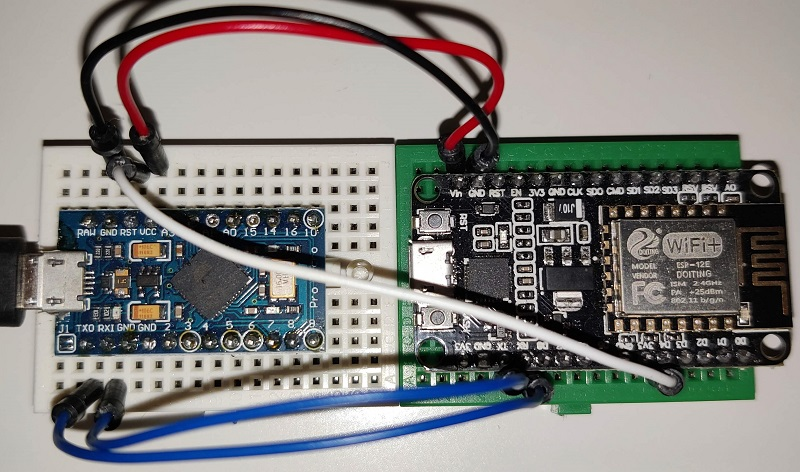

# ESPHome Ducky

## What is it?
Control devices with a virtual usb keyboard/mouse from mqtt.

## How does it work?
* The arduino is emulating HIDs (Human Interface Devices) such as keyboard/mouse via USB
* The ESPHome board is receiving commands via wifi/mqtt and writes them to the serial port
* The commands are in Ducky Script syntax
* The commands are read from the serial port by the arduino and executed as keyboard/mouse actions
* Furthermore it's possible to get the host machine's power state from the USB state via the serial port

## Credits:
* Esphome: https://github.com/esphome/esphome
* The main insperation is the usage of the "wifi_ducky" project: https://github.com/spacehuhn/wifi_ducky
* Mouse support and some more code was taken from: https://github.com/TheMMcOfficial/CJMCU-3212-wifi_ducky
* USB HID emulation and language layouts are from: https://github.com/NicoHood/HID
* Serial communication: https://forum.arduino.cc/t/serial-input-basics-updated/382007

<a href="https://www.buymeacoffee.com/jensweimann" target="_blank"></a>

## Community
https://community.home-assistant.io/t/esphome-ducky/377600

## Get Started
### 1. You will need
#### 1.1 Software
* ESPHome, see https://esphome.io/guides/getting_started_hassio.html
* Visual Studio Code with PlatformIO, see https://platformio.org/install/ide?install=vscode
#### 1.2 Hardware
* Supported arduino board, see: https://github.com/NicoHood/HID/blob/master/Readme.md
  *  Example: https://s.click.aliexpress.com/e/_9I1dPI
* Supported ESP8266 or ESP32 board, see: https://esphome.io/#devices
  * Example 1: https://s.click.aliexpress.com/e/_ArGz12
  * Example 2: https://s.click.aliexpress.com/e/_Ak9SzQ
* Breadboard and jumper wires or soldering skills
  * Example: https://s.click.aliexpress.com/e/_ABTaNm
  * Example: https://s.click.aliexpress.com/e/_AdVgok
* Micro USB Cable
* CJMCU-3212 (alternative)
 This neat device combines the two above boards in one. Unfortunately I can't recommend it since the wifi reception is pretty poor on my unit and the flashing process is not as simple, see: https://github.com/TheMMcOfficial/CJMCU-3212-wifi_ducky But with the SD card reader it's possible to execute pre-written scripts.
  * Example 1: https://s.click.aliexpress.com/e/_ApGiWC
  * Example 2: https://s.click.aliexpress.com/e/_AbiQtA

### 2. Wiring
This is mostly taken from the wifi_ducky project:

| Arduino                 | Esp8266       |
| ------------------------|:-------------:|
| TX                      | RX            |
| RX                      | TX            |
| GND                     | GND           |
| VCC (5V)                | Vin           |
| RST (Optional)          | D4            |

*Pay attention to not mix up 5V from Arduino and 3.3V of ESP8266. Also do not connect both boards simultaneously via USB since one board is passing power to the other.*

**Example: Arduino Pro Micro and NodeMCU**


### 3. Flashing
#### 3.1 Visual Studio Code
* Checkout/Download and open this project
* It's important to adjust the simulated keyboard's language to your machine's system language if you want to inject text. Currently the german keyboard layout is defined. Adjust keyboard language: For english it is sufficient to comment out the first two lines in [src/main.cpp](src/main.cpp). For other languages, see: https://github.com/NicoHood/HID/blob/master/src/KeyboardLayouts/ImprovedKeylayouts.h#L659 
* Adjust the port in [platformio.ini](platformio.ini) and flash
#### 3.2 ESPHome
* Create a new ESPHome project, paste and adjust the yaml file [esphome/nodemcu.yaml](esphome/nodemcu.yaml) (see comments)
* Copy the [esphome/uart_read_line_sensor.h](esphome/uart_read_line_sensor.h) in your ESPHome folder (/config/esphome)
* Flash the firmware

### 4. Usage
Send the ducky payload to the mqtt topic. For mqtt topic definition, see [esphome/nodemcu.yaml](esphome/nodemcu.yaml)

Ducky Script syntax:
https://docs.hak5.org/hc/en-us/articles/360010555153-Ducky-Script-the-USB-Rubber-Ducky-language

#### 4.1 Example Call from Home Assistant
```
service: mqtt.publish
data:
  topic: esphome/nodemcu/run
  payload: |
    GUI r
    DELAY 200
    STRING notepad.exe
    ENTER
    DELAY 200
    STRING Hello World
```
#### 4.2 Home Assitant Examples
* Windows PC [homeassistant/ha_windows_control.yaml](homeassistant/ha_windows_control.yaml)
* Android TV Box  [homeassistant/ha_android_control.yaml](homeassistant/ha_android_control.yaml)

#### 4.3 Sensors
* host_state: Host/usb port power state (ON/OFF/SLEEP)
* nodemcu_response: Ducky scripts execution feedback (ready/busy), usefull for observing long running scripts
* usb_input: Receive messages from arduinos serial port, usefull for custom feedback messages from connected machine

## Limitations:
* I don't have much time to support this project
* I don't have much experience in this topic so the code is improvable
* The current implementation may be not 100% compatible with all possible ducky keywords, but most commands should be working.
* It is possible that some machines won't recognize this device since it's emulating multiple HID devices. I never had such issues but your mileage may vary
* One message is limited to 255 characters including line endings
* Mouse movement is mostly untestet
* Gamepad support is possible but currently not implemented, see https://github.com/NicoHood/HID/wiki/Gamepad-API

